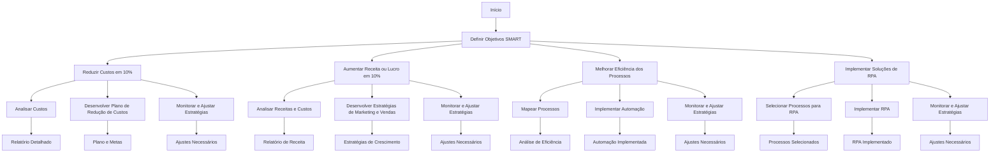

# Estratégia de Vendas para Serviços de TI 🚀💼

## Objetivos da Proposta 🎯

1. **Reduzir Custos em 10%** 💸
2. **Aumentar Receita ou Lucro em 10%** 📈

## Metodologia SMART 🌟

### Objetivos SMART 🏆

| **Objetivo**                                      | **Específico (Specific)**                     | **Mensurável (Measurable)**                  | **Atingível (Achievable)**                   | **Relevante (Relevant)**                    | **Temporal (Time-bound)**                   |
|---------------------------------------------------|------------------------------------------------|----------------------------------------------|---------------------------------------------|---------------------------------------------|---------------------------------------------|
| **Reduzir Custos em 10%**                        | Reduzir os custos operacionais em 10%         | Monitorar os custos totais da empresa        | Redução viável com revisão de processos     | Importante para melhorar a margem de lucro | Em 6 meses                                 |
| **Aumentar Receita ou Lucro em 10%**             | Aumentar a receita ou lucro em 10%             | Comparar receita e lucro antes e depois      | Alcançável com estratégias de marketing e vendas | Crucial para o crescimento da empresa       | Em 6 meses                                 |
| **Melhorar a Eficiência dos Processos**           | Aumentar a eficiência dos processos críticos   | Medir o tempo e custo dos processos          | Realizável com automação e otimização        | Necessário para reduzir custos e aumentar lucro | Em 3 meses                                 |
| **Implementar Soluções de RPA**                   | Implementar sistemas de RPA para processos-chave | Contar o número de processos automatizados    | Implementação possível com ferramentas RPA | Essencial para melhorar a eficiência operacional | Em 4 meses                                 |

### Ações SMART 🔧

| **Ação**                                          | **Específico (Specific)**                     | **Mensurável (Measurable)**                  | **Atingível (Achievable)**                   | **Relevante (Relevant)**                    | **Temporal (Time-bound)**                   |
|---------------------------------------------------|------------------------------------------------|----------------------------------------------|---------------------------------------------|---------------------------------------------|---------------------------------------------|
| **Analisar Custos**                              | Revisar todas as despesas operacionais        | Relatório detalhado de custos                | Realizável com análise financeira            | Ajuda a identificar áreas para redução     | Dentro de 1 mês                             |
| **Desenvolver Plano de Redução de Custos**        | Criar um plano detalhado para cortar 10% dos custos | Documento com plano e metas                  | Implementável com equipe dedicada           | Essencial para alcançar o objetivo de redução de custos | Dentro de 2 meses                           |
| **Implementar Automação de Processos**            | Escolher processos para automação e implementar RPA | Número de processos automatizados             | Viável com ferramentas de RPA e treinamento | Importante para reduzir custos e aumentar eficiência | Dentro de 4 meses                           |
| **Monitorar e Ajustar Estratégias**               | Revisar os resultados e ajustar estratégias conforme necessário | Relatórios de desempenho e ajustes realizados | Possível com acompanhamento contínuo        | Crucial para garantir que as metas sejam alcançadas | Revisões mensais até atingir o objetivo final |

## Diagrama de Metodologia SMART 📊

